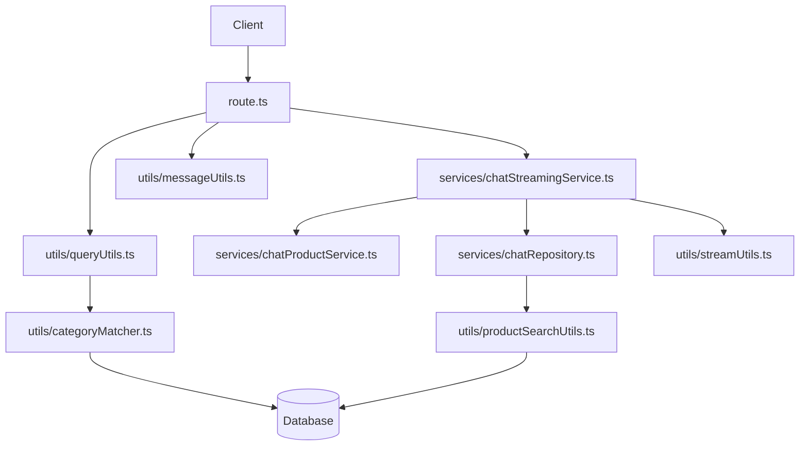

# Next.js Chat API

This directory contains the Next.js API implementation for the BodyFuel chat feature, migrated from the Express.js implementation. It provides AI-powered product search and recommendations through a conversational interface with real-time streaming.

## Directory Structure

```
apps/shop/src/app/api/chat/
├── config/
│   └── aiConfig.ts              # DeepSeek AI configuration
├── schema/
│   └── apiSchema.ts             # Zod validation schemas
├── types/
│   └── chatTypes.ts             # TypeScript type definitions
├── utils/
│   ├── apiHelpers.ts            # Request validation & error handling
│   ├── messageUtils.ts          # Message formatting for AI
│   ├── queryUtils.ts            # Query parsing & product detection
│   ├── categoryMatcher.ts       # Category matching logic
│   ├── productSearchUtils.ts    # Database streaming logic
│   └── streamUtils.ts           # Next.js streaming utilities
├── services/
│   ├── chatProductService.ts    # Product search & formatting
│   ├── chatStreamingService.ts  # Streaming orchestration
│   ├── chatRepository.ts        # Database access layer
├── route.ts                     # Main Next.js API route handler
└── README.md                    # This documentation
```

## Architecture Overview

The chat feature follows a clean layered architecture:



## Key Features

### Real-time Product Streaming

- Products are streamed one-by-one with 500ms delays
- Uses AI SDK's `createDataStreamResponse` for Next.js compatibility
- Maintains the exact same user experience as the Express implementation

### Advanced Search Capabilities

- **Natural Language Processing**: Extracts search queries and price ranges from user messages
- **Category Matching**: Intelligent category detection with fuzzy matching
- **Price Filtering**: Supports "under $X", "over $X", and "between $X and $Y" queries
- **Query Expansion**: Automatically expands search terms with common variations

### AI Integration

- **DeepSeek Integration**: Streaming AI responses with product context
- **Context Management**: Maintains conversation history for better responses
- **Product Context**: Injects product information into AI prompts

## API Endpoints

### POST /api/chat

Processes chat messages and returns streaming responses.

**Request Body:**

```typescript
{
  conversationId?: string;
  messages: Array<{
    id?: string;
    role: "system" | "user" | "assistant";
    content: string;
  }>;
}
```

**Response:**

- Streaming response using AI SDK's data stream format
- Headers include `X-Conversation-ID` and `X-Streaming-Products`

## Migration from Express

This implementation maintains 100% functional compatibility with the original Express implementation while adapting to Next.js patterns:

### Key Changes

1. **Route Handler**: Express controller → Next.js route handler (`route.ts`)
2. **Streaming**: Express SSE → AI SDK `createDataStreamResponse`
3. **Database Access**: Direct `@repo/database` imports (no API calls)
4. **Error Handling**: Next.js Response objects instead of Express responses
5. **Import Paths**: Removed `.js` extensions for TypeScript compatibility

### Preserved Functionality

- ✅ Real-time product streaming with 500ms delays
- ✅ Advanced search with category matching and price filtering
- ✅ DeepSeek AI integration with product context
- ✅ Database direct access using Prisma
- ✅ All original query parsing and category matching logic

## Usage Examples

### Basic Product Search

```typescript
const response = await fetch("/api/chat", {
  method: "POST",
  headers: { "Content-Type": "application/json" },
  body: JSON.stringify({
    messages: [{ role: "user", content: "Show me protein powders under $50" }],
  }),
});
```

### Streaming Response Handling

```typescript
const reader = response.body?.getReader();
const decoder = new TextDecoder();

while (true) {
  const { done, value } = await reader.read();
  if (done) break;

  const chunk = decoder.decode(value);
  // Process streaming data
}
```

## Development

### Building Dependencies

After making changes to shared packages, build them:

```bash
npm run build --workspace=packages/shared
npm run build --workspace=packages/database
```

### Environment Variables

Required environment variables:

- `DEEPSEEK_API`: DeepSeek API key
- `DATABASE_URL`: PostgreSQL connection string

### Testing

The API can be tested using the existing chat widget in the shop application or with direct HTTP requests.

## Performance Considerations

- **Database Queries**: Optimized with proper indexing and query limits
- **Streaming**: Products stream individually to reduce perceived latency
- **Context Management**: Limited to last 5 messages to control token usage
- **Caching**: Category data is cached for 5 minutes to reduce database load

## Error Handling

The API includes comprehensive error handling:

- **Validation Errors**: Zod schema validation with detailed error messages
- **Database Errors**: Graceful fallbacks and error logging
- **Streaming Errors**: Proper cleanup and error propagation
- **AI Errors**: Fallback responses when AI service is unavailable

## Future Enhancements

- **Conversation Persistence**: Currently conversations are not persisted
- **User Context**: Personalized recommendations based on user history
- **Advanced Analytics**: Track search patterns and popular queries
- **Multi-language Support**: Extend category matching for multiple languages
