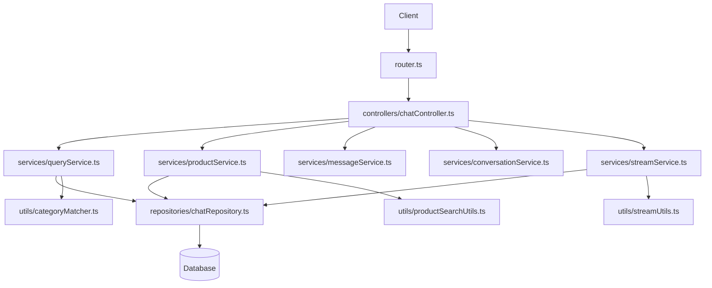
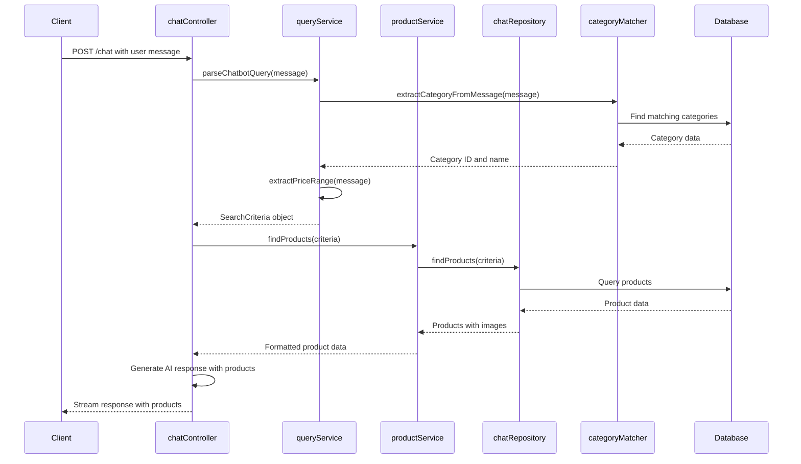
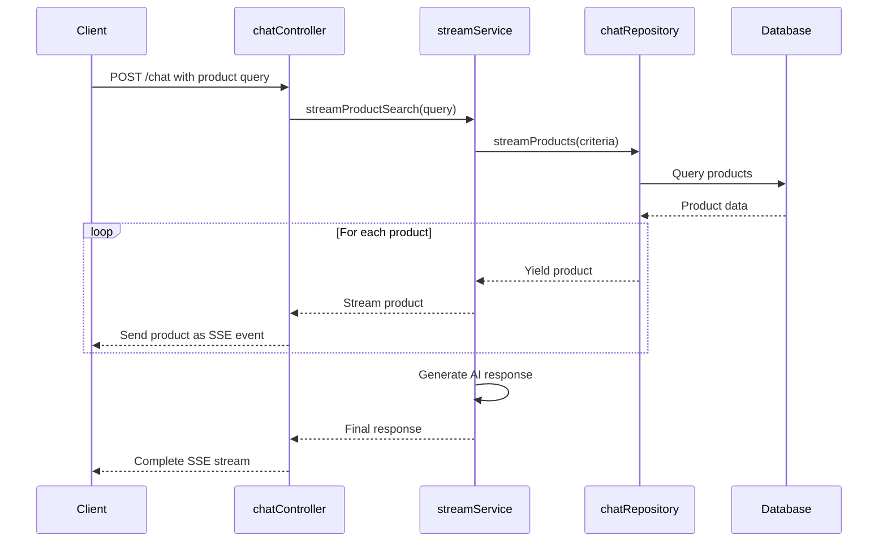

# Chat Feature Architecture

This directory contains the chat feature implementation for the BodyFuel application, which provides AI-powered product search and recommendations through a conversational interface.

## Directory Structure

```
apps/backend/src/features/chat/
├── controllers/       # HTTP request handlers
├── repositories/      # Data access layer
├── services/          # Business logic
├── types/             # TypeScript type definitions
├── utils/             # Helper functions
└── router.ts          # Express router configuration
```

## Architecture Overview

The chat feature follows the Controller-Service-Repository pattern:



## Component Interactions

### Request Flow

1. **Client Request**: The client sends a chat message to the `/chat` endpoint
2. **Router**: `router.ts` routes the request to the appropriate controller method
3. **Controller**: `chatController.ts` validates the request and orchestrates the response
4. **Services**: Various service modules handle specific aspects of the request:
   - `queryService.ts`: Extracts search queries and price ranges from user messages
   - `productService.ts`: Searches for products based on extracted criteria
   - `messageService.ts`: Formats messages for AI processing
   - `conversationService.ts`: Manages conversation state
   - `streamService.ts`: Handles streaming responses for real-time product updates
5. **Repository**: `chatRepository.ts` interacts with the database to fetch products
6. **Response**: The controller sends the response back to the client

### Data Flow for Product Search



### Streaming Response Flow

For real-time product updates, the feature uses Server-Sent Events (SSE):



## Key Components

### Controllers

- **chatController.ts**: Handles HTTP requests and responses for the chat feature
  - `processChat`: Processes new chat messages and generates AI responses
  - `getConversationHistory`: Returns conversation history (currently stubbed)

### Services

- **queryService.ts**: Extracts search queries and price ranges from user messages

  - `extractSearchQuery`: Parses user messages to identify product search terms
  - `extractPriceRange`: Identifies price constraints in user messages
  - `parseChatbotQuery`: Combines search query and price range into search criteria

- **productService.ts**: Handles product search and formatting

  - `findProducts`: Searches for products based on criteria
  - `formatProductsForAI`: Formats product data for AI context
  - `createProductHtml`: Generates HTML for product display

- **messageService.ts**: Manages message formatting and processing

  - `formatMessagesForAI`: Prepares messages for AI processing
  - `createSystemMessage`: Generates system prompts for the AI

- **conversationService.ts**: Manages conversation state

  - `handleConversation`: Creates or retrieves conversation data

- **streamService.ts**: Handles streaming responses
  - `streamProductSearch`: Streams products one by one for real-time updates

### Repositories

- **chatRepository.ts**: Data access layer for chat-related queries
  - `findProducts`: Queries the database for products matching criteria
  - `streamProducts`: Generator function that yields products one by one
  - `findCategoryByName`: Finds categories by name

### Utils

- **categoryMatcher.ts**: Utilities for matching product categories

  - `findCategoryBySearchTerm`: Finds categories based on search terms
  - `extractCategoryFromMessage`: Extracts category information from messages
  - `expandSearchQuery`: Expands search queries with common variations

- **productSearchUtils.ts**: Utilities for product search

  - `buildWhereClause`: Builds database query conditions
  - `streamProducts`: Streams products from the database

- **streamUtils.ts**: Utilities for streaming responses
  - `createDataStreamResponse`: Creates SSE response streams

### Types

- **chat.types.ts**: TypeScript type definitions for the chat feature
  - `ChatMessage`: Represents a single message in a conversation
  - `Conversation`: Represents a chat conversation
  - `ChatbotSearchCriteria`: Search parameters for product queries
  - `ProductData`: Product information structure

## Usage Examples

### Processing a Chat Message

```typescript
// In a controller or service
import { parseChatbotQuery } from "../services/queryService.js";
import { findProducts } from "../services/productService.js";

async function handleProductQuery(userMessage: string) {
  // Extract search criteria from the user message
  const criteria = await parseChatbotQuery(userMessage);

  // Find products matching the criteria
  const products = await findProducts(criteria);

  // Process and return the products
  return products;
}
```

### Using Category Matcher

```typescript
// In a service
import { extractCategoryFromMessage } from "../utils/categoryMatcher.js";

async function getCategoryFromMessage(message: string) {
  const category = await extractCategoryFromMessage(message);

  if (category) {
    console.log(`Found category: ${category.name} (ID: ${category.id})`);
    return category;
  }

  return null;
}
```

## Best Practices

1. **Separation of Concerns**: Keep controllers thin, with business logic in services
2. **Type Safety**: Use the defined types from `chat.types.ts` for all function parameters and returns
3. **Error Handling**: Use try/catch blocks and proper error logging
4. **Testing**: Write unit tests for services and utilities
5. **Documentation**: Keep JSDoc comments up to date for all functions

## Extending the Feature

When extending the chat feature:

1. Add new types to `chat.types.ts`
2. Implement business logic in appropriate service files
3. Add data access methods to repositories
4. Update controllers to use new services
5. Add utility functions as needed
6. Update this README to reflect architectural changes

## Known Issues and Limitations

- Conversations are not currently persisted to the database
- The GET endpoint for conversation history returns a 404
- Product search is limited to 5 results per query

## Future Improvements

- Implement conversation persistence
- Add user context for personalized recommendations
- Improve category matching with machine learning
- Add support for more complex product queries
