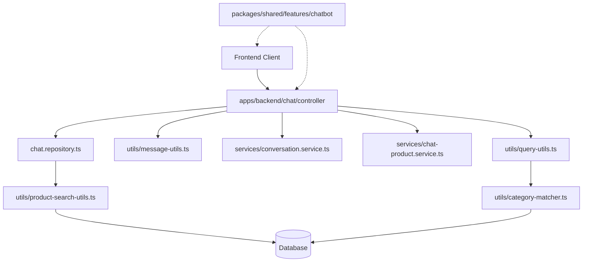

# BodyFuel Chat API

This directory contains the Express.js backend implementation for the BodyFuel chat feature. It provides AI-powered product search and recommendations through a conversational interface with real-time streaming using AI SDK.

## Directory Structure

```
apps/backend/src/features/chatbot/
├── config/
│   └── ai-config.ts             # DeepSeek AI configuration
├── utils/
│   ├── message-utils.ts         # Message formatting for AI
│   ├── query-utils.ts           # Query parsing & product detection
│   ├── product-search-utils.ts  # Database product search logic
│   ├── category-matcher.ts      # Category matching logic
│   ├── stream-utils.ts          # Legacy streaming utilities (deprecated)
│   └── error-handler.ts         # Error handling utilities
├── services/
│   ├── chat-product.service.ts  # Product search & formatting
│   ├── conversation.service.ts  # Conversation management
│   └── s3Service.ts             # S3 image handling
├── chat.controller.ts           # Express controller with AI SDK streaming
├── chat.repository.ts           # Database access layer
└── README.md                    # This documentation

packages/shared/src/features/chatbot/
├── schemas/
│   └── chatSchema.ts            # Zod validation schemas & inferred types
├── types/
│   └── chatTypes.ts             # Additional TypeScript type definitions
└── index.ts                     # Feature exports

apps/shop/src/features/chatbot/
├── components/
│   └── ChatWidget.tsx           # Main chat UI component
└── hooks/
    └── useProductChat.ts        # Custom hook using AI SDK useChat
```

## Architecture Overview

The chat feature follows a clean layered architecture with shared types:



## Key Features

### AI SDK Integration

- **Proper AI SDK Usage**: Uses `streamText()` and `pipeDataStreamToResponse()` from AI SDK
- **Data Streaming**: Products streamed via AI SDK's data stream protocol
- **No Manual SSE**: Eliminated custom Server-Sent Events implementation

### Real-time Product Streaming

- Products are streamed one-by-one with 500ms delays
- Uses AI SDK's `pipeDataStreamToResponse` for Express.js compatibility
- Simplified streaming approach using only AI SDK data streams

### Advanced Search Capabilities

- **Natural Language Processing**: Extracts search queries and price ranges from user messages
- **Category Matching**: Intelligent category detection with fuzzy matching
- **Price Filtering**: Supports "under $X", "over $X", and "between $X and $Y" queries
- **Query Expansion**: Automatically expands search terms with common variations

### AI Integration

- **DeepSeek Integration**: Streaming AI responses with product context
- **Context Management**: Maintains conversation history for better responses
- **Product Context**: Injects product information into AI prompts

### Shared Type System

- **Single Source of Truth**: All types defined in `packages/shared/features/chatbot`
- **Type Safety**: Consistent types across frontend and backend
- **Zod Validation**: Request validation using shared schemas

## API Endpoints

### POST /api/chat

Processes chat messages and returns streaming responses.

**Request Body:**

```typescript
{
  conversationId?: string;
  messages: Array<{
    id?: string;
    role: "system" | "user" | "assistant";
    content: string;
  }>;
}
```

**Response:**

- Streaming response using AI SDK's data stream format
- Headers include `X-Conversation-ID` and `X-Streaming-Products`

## Code Consolidation & Improvements

This implementation has been significantly improved and consolidated:

### ✅ Completed Improvements

1. **Shared Type System**: All types moved to `packages/shared/features/chatbot`
2. **Removed Obsolete Code**: Eliminated legacy streaming utilities and duplicate schemas
3. **AI SDK Integration**: Proper use of AI SDK streaming instead of manual implementations
4. **Simplified Architecture**: Direct frontend to backend communication using shared types
5. **Simplified Product Extraction**: Removed complex regex parsing for embedded product tags
6. **Clean Architecture**: Clear separation between shared types, backend logic, and frontend UI

## Usage Examples

### Basic Product Search

```typescript
// Frontend using AI SDK useChat hook with shared types
import { ChatRequest, ChatMessage } from "@repo/shared";

const { messages, data, isLoading } = useChat({
  api: "/api/chat",
  streamProtocol: "data",
});

// Process streaming product data
useEffect(() => {
  if (data?.length > 0) {
    const latestData = data[data.length - 1];
    if (latestData.type === "product") {
      setStreamedProducts((prev) => [...prev, ...latestData.products]);
    }
  }
}, [data]);
```

### AI SDK Streaming Integration

```typescript
// Backend streaming implementation
pipeDataStreamToResponse(res, {
  execute: async (dataStream) => {
    // Stream products via data stream
    await dataStream.writeData({
      type: "product",
      products: [product],
      count: i + 1,
    });

    // Stream AI response
    const result = streamText({
      model: getDeepSeek()("deepseek-chat"),
      system: systemMessage,
      messages: messagesForAI,
    });

    result.mergeIntoDataStream(dataStream);
  },
});
```

### Frontend AI SDK Hook Usage

```typescript
// Frontend using AI SDK useChat hook
const { messages, data, isLoading } = useChat({
  api: "/api/chat",
  streamProtocol: "data",
});

// Process streaming product data
useEffect(() => {
  if (data?.length > 0) {
    const latestData = data[data.length - 1];
    if (latestData.type === "product") {
      setStreamedProducts((prev) => [...prev, ...latestData.products]);
    }
  }
}, [data]);
```

## Development

### Building Dependencies

After making changes to shared packages, build them:

```bash
npm run build --workspace=packages/shared
npm run build --workspace=packages/database
```

### Working with Shared Types

1. **Adding New Types**: Add to `packages/shared/src/features/chatbot/types/chatTypes.ts`
2. **Schema Changes**: Modify `packages/shared/src/features/chatbot/schemas/chatSchema.ts`
3. **Rebuild**: Always rebuild shared package after changes

### Environment Variables

Required environment variables:

- `DEEPSEEK_API`: DeepSeek API key
- `DATABASE_URL`: PostgreSQL connection string

### Testing

The API can be tested using:

- Chat widget in the shop application
- Direct HTTP requests to `/api/chat`
- Postman/Thunder Client for API testing

## Performance Considerations

- **Database Queries**: Optimized with proper indexing and query limits
- **AI SDK Streaming**: Products stream individually to reduce perceived latency
- **Context Management**: Limited to last 5 messages to control token usage
- **Caching**: Category data is cached for 5 minutes to reduce database load
- **Type Safety**: Shared types eliminate runtime type errors

## Error Handling

The API includes comprehensive error handling:

- **Validation Errors**: Zod schema validation with detailed error messages from shared schemas
- **Database Errors**: Graceful fallbacks and error logging
- **Streaming Errors**: Proper cleanup and error propagation via AI SDK
- **AI Errors**: Fallback responses when AI service is unavailable
- **Type Errors**: Compile-time type checking with shared types

## Architecture Benefits

### ✅ Achieved Goals

1. **DRY Principle**: Single source of truth for types and schemas
2. **Type Safety**: Consistent types across frontend/backend
3. **Maintainability**: Clear separation of concerns
4. **Performance**: Proper AI SDK usage instead of manual streaming
5. **Code Quality**: Removed obsolete and duplicate code

### 🔄 Simplified Streaming Flow

**Previous**: Complex dual streaming (data stream + embedded tags)

```
Manual SSE → Custom parsing → Complex regex extraction
```

**Current**: Clean AI SDK integration

```
AI SDK streamText() → pipeDataStreamToResponse() → useChat() hook
```

## Future Enhancements

- **Conversation Persistence**: Database storage for conversation history
- **User Context**: Personalized recommendations based on user history
- **Advanced Analytics**: Track search patterns and popular queries
- **Multi-language Support**: Extend category matching for multiple languages
- **Enhanced Error Boundaries**: More granular error handling and recovery
