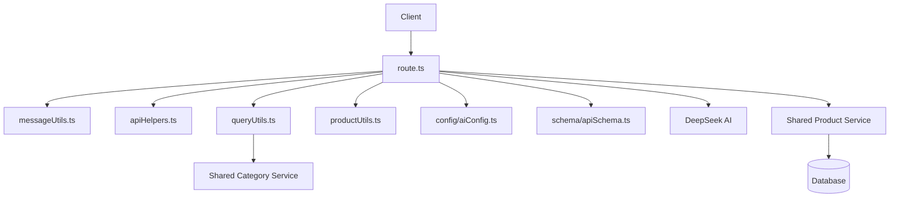

# Chat API Architecture

This directory contains the chat API implementation for the BodyFuel application, providing AI-powered product search and recommendations through a conversational interface using DeepSeek AI.

## Directory Structure

```
apps/shop/src/app/api/chat/
├── config/
│   └── aiConfig.ts     # AI configuration and DeepSeek setup
├── schema/
│   └── apiSchema.ts    # Zod schemas and validation types
├── types/
│   └── chatTypes.ts    # Chat-related types and interfaces
├── utils/
│   ├── queryUtils.ts   # Message parsing & query extraction functions
│   ├── messageUtils.ts # Message processing and formatting utilities
│   ├── productUtils.ts # Product formatting for AI and HTML output
│   └── apiHelpers.ts   # Request validation and error handling
├── route.ts           # Next.js API route using shared productService directly
└── README.md          # This documentation
```

## Architecture Overview

The chat API follows a simplified, utility-based architecture optimized for Next.js API routes:



## Request Flow

1. **Client Request**: The client sends a chat message to the `/api/chat` Next.js API route
2. **Route Handler**: `route.ts` handles the POST request and processes the entire flow
3. **Schema Validation**: Uses `schema/apiSchema.ts` for Zod schema validation
4. **Request Validation**: Uses `apiHelpers.ts` to validate and parse the request
5. **Message Processing**: Uses `messageUtils.ts` to format messages and detect product queries
6. **Query Parsing**: Uses `queryUtils.ts` to extract search criteria from natural language
7. **Product Search**: If product query, uses shared `productService` directly for search
8. **Product Formatting**: Uses `productUtils.ts` to format products for AI and HTML output
9. **AI Integration**: Uses `config/aiConfig.ts` to configure and interact with DeepSeek AI
10. **Streaming Response**: Returns streaming AI response with optional product data

## Key Components

### Route Handler

- **route.ts**: Main Next.js API route containing all business logic
  - Handles both product queries and general chat
  - Integrates all utility functions
  - Manages streaming responses with DeepSeek AI
  - Supports both single message and message array formats

### Schema & Types

- **schema/apiSchema.ts**: Zod schemas and validation types

  - `chatRequestSchema`: Request validation schema
  - `chatMessageSchema`: Message structure validation
  - `ChatRequestType` & `ChatMessageType`: Inferred types
  - `ErrorResponse` & `SuccessResponse`: API response types

- **types/chatTypes.ts**: Core chat-related types
  - `ChatMessage`: Message structure for conversations
  - `AIMessageFormat`: Format for AI processing
  - `ChatbotSearchCriteria`: Product search parameters
  - `StreamProductResponse`: Product streaming response format

### Configuration

- **config/aiConfig.ts**: AI model configuration
  - DeepSeek client initialization
  - AI configuration constants (`temperature`, `maxTokens`)
  - Model settings and parameters

### Utilities

- **utils/queryUtils.ts**: Message parsing & query extraction

  - `extractSearchQuery`: Extract search terms from messages
  - `extractPriceFromQuery`: Parse price ranges from queries
  - `parseChatbotQuery`: Extract complete search criteria
  - `isProductQuery`: Detect product-related queries

- **utils/messageUtils.ts**: Message processing and formatting

  - `getCurrentMessage`: Extract current message from request
  - `formatMessagesForAI`: Format messages for AI consumption
  - `createMessage`: Create properly formatted messages
  - `createSystemMessage`: Generate AI system prompts

- **utils/productUtils.ts**: Product formatting for AI and HTML output

  - `formatProductsForAI`: Format products for AI context
  - `createProductHtml`: Generate product display HTML

- **utils/apiHelpers.ts**: Request validation and error handling
  - `validateChatRequest`: Validate incoming requests using schemas
  - `validateMessage`: Ensure message content exists
  - `createErrorResponse`: Generate standardized error responses

## Usage Examples

### Schema Validation

```typescript
import { chatRequestSchema } from "./schema/apiSchema";

const body = await request.json();
const validationResult = chatRequestSchema.safeParse(body);
```

### Processing a Chat Message

```typescript
export async function POST(request: NextRequest) {
  try {
    const body = await request.json();
    const validationResult = chatRequestSchema.safeParse(body);
    const validation = validateChatRequest(validationResult);

    if (!validation.success) {
      return validation.response;
    }

    const { message, messages = [] } = validation.data;
    const currentMessage = getCurrentMessage(message, messages);

    if (isProductQuery(currentMessage)) {
      return await handleProductQuery(currentMessage, messages);
    } else {
      return await handleGeneralChat(currentMessage, messages);
    }
  } catch (error) {
    return createErrorResponse(
      "Internal server error",
      "Failed to process chat request"
    );
  }
}
```

### Using Utility Functions

```typescript
// Detecting product queries
import { isProductQuery } from "./utils/queryUtils";

const message = "I'm looking for protein powder under $50";
const isProduct = isProductQuery(message); // true

// Parsing product queries
import { parseChatbotQuery } from "./utils/queryUtils";

const criteria = await parseChatbotQuery(message);
// Returns: { query: "protein powder", maxPrice: 50, ... }

// Validating requests
import { validateChatRequest } from "./utils/apiHelpers";

const validation = validateChatRequest(validationResult);
if (!validation.success) {
  return validation.response; // Error response
}
```

## Best Practices

1. **Schema-First Validation**: Use Zod schemas in `schema/` folder for all validation
2. **Utility-Based Architecture**: Organize related functionality into focused utility files
3. **Shared Services**: Leverage existing shared services (`@repo/shared`) for consistency
4. **Type Safety**: Use Zod schemas and TypeScript types throughout
5. **Streaming Responses**: Utilize AI SDK's streaming for better UX
6. **Error Handling**: Implement proper validation and error responses
7. **Separation of Concerns**: Keep utilities focused on single responsibilities

## Architecture Benefits

### Clean Separation

- **schema/**: Validation schemas and API types
- **config/**: Configuration and setup
- **types/**: Business logic types
- **utils/**: Focused utility functions
- **route.ts**: Single entry point with integrated logic

### Schema-Driven Development

- **Type Safety**: Zod schemas ensure runtime validation
- **Consistent APIs**: Centralized schema definitions
- **Better DX**: IntelliSense and type checking

### Utility-Based Design

- **Reusable Functions**: Utilities can be easily tested and reused
- **Single Responsibility**: Each utility handles one concern
- **Clear Dependencies**: Easy to understand what each file does

## Extending the API

When extending the chat API:

1. **Add Schemas**: Update schema files in `schema/` folder
2. **Add Types**: Update type files in `types/` folder
3. **Add Utilities**: Create new utility functions in appropriate `utils/` files
4. **Update Route**: Modify `route.ts` to integrate new functionality
5. **Maintain Structure**: Keep utilities focused and single-purpose

### Adding New Features

```typescript
// Example: Adding new request schema
// File: schema/apiSchema.ts
export const newFeatureSchema = z.object({
  // New schema definition
});

// Example: Adding sentiment analysis utility
// File: utils/sentimentUtils.ts
export async function analyzeSentiment(message: string) {
  // Implementation here
}

// Then use in route.ts
import { newFeatureSchema } from "./schema/apiSchema";
import { analyzeSentiment } from "./utils/sentimentUtils";
```

## Dependencies

### Core Dependencies

- **@ai-sdk/deepseek**: DeepSeek AI integration
- **ai**: AI SDK for streaming responses
- **zod**: Schema validation
- **@repo/shared**: Shared product and category services

### Environment Variables

- `DEEPSEEK_API`: DeepSeek API key (required)

## File Structure Benefits

- **schema/**: Centralized validation schemas
- **config/**: Configuration and setup
- **types/**: Business logic type definitions
- **utils/**: Focused utility functions
- **route.ts**: Single entry point with integrated logic
- **README.md**: Complete documentation

This structure provides clear separation between validation schemas, business types, configuration, and utilities while maintaining simplicity and ease of maintenance.
