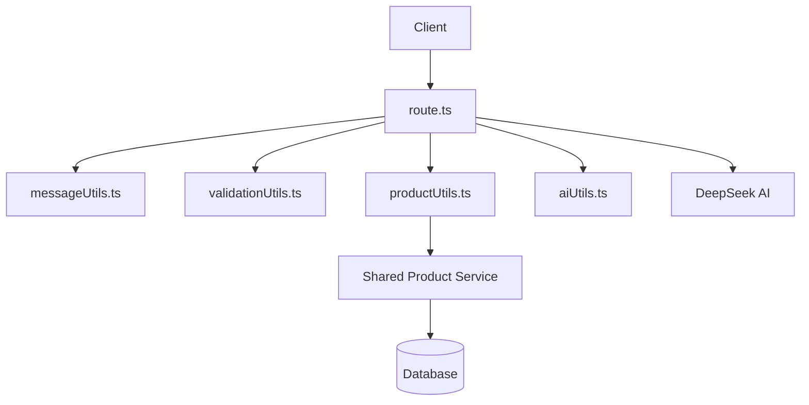

# Chat API Architecture

This directory contains the chat API implementation for the BodyFuel application, providing AI-powered product search and recommendations through a conversational interface using DeepSeek AI.

## Directory Structure

```
apps/shop/src/app/api/chat/
├── types/
│   ├── chatTypes.ts    # Chat-related types and interfaces
│   └── apiTypes.ts     # API request/response schemas and types
├── utils/
│   ├── aiUtils.ts      # AI model initialization and configuration
│   ├── messageUtils.ts # Message processing and formatting utilities
│   ├── productUtils.ts # Product search, parsing, and formatting
│   └── validationUtils.ts # Request validation and error handling
├── route.ts           # Next.js API route with integrated logic
└── README.md          # This documentation
```

## Architecture Overview

The chat API follows a simplified, utility-based architecture optimized for Next.js API routes:



## Request Flow

1. **Client Request**: The client sends a chat message to the `/api/chat` Next.js API route
2. **Route Handler**: `route.ts` handles the POST request and processes the entire flow
3. **Validation**: Uses `validationUtils.ts` to validate and parse the request
4. **Message Processing**: Uses `messageUtils.ts` to determine if it's a product query and format messages
5. **Product Search**: If product query, uses `productUtils.ts` to search and format products
6. **AI Integration**: Uses `aiUtils.ts` to configure and interact with DeepSeek AI
7. **Streaming Response**: Returns streaming AI response with optional product data

## Key Components

### Route Handler

- **route.ts**: Main Next.js API route containing all business logic
  - Handles both product queries and general chat
  - Integrates all utility functions
  - Manages streaming responses with DeepSeek AI
  - Supports both single message and message array formats

### Types

- **types/chatTypes.ts**: Core chat-related types
  - `ChatMessage`: Message structure for conversations
  - `AIMessageFormat`: Format for AI processing
  - `ChatbotSearchCriteria`: Product search parameters
  - `StreamProductResponse`: Product streaming response format

- **types/apiTypes.ts**: API schemas and validation
  - `chatRequestSchema`: Zod schema for request validation
  - `ErrorResponse` & `SuccessResponse`: Standardized API responses

### Utilities

- **utils/aiUtils.ts**: AI model configuration
  - DeepSeek client initialization
  - AI configuration constants
  - Model settings and parameters

- **utils/messageUtils.ts**: Message processing
  - `getCurrentMessage`: Extract current message from request
  - `formatMessagesForAI`: Format messages for AI consumption
  - `isProductQuery`: Detect product-related queries
  - `createMessage`: Create properly formatted messages

- **utils/productUtils.ts**: Product search and formatting
  - `parseChatbotQuery`: Extract search criteria from messages
  - `searchProductsForChat`: Search products using shared service
  - `formatProductsForAI`: Format products for AI context
  - `createProductHtml`: Generate product display HTML
  - `createSystemMessage`: Generate AI system prompts

- **utils/validationUtils.ts**: Request validation and error handling
  - `validateChatRequest`: Validate incoming requests
  - `validateMessage`: Ensure message content exists
  - `createErrorResponse`: Generate standardized error responses

## Usage Examples

### Processing a Chat Message

```typescript
// The main route handler in route.ts
export async function POST(request: NextRequest) {
  try {
    const body = await request.json();
    const validationResult = chatRequestSchema.safeParse(body);
    const validation = validateChatRequest(validationResult);
    
    if (!validation.success) {
      return validation.response;
    }

    const { message, messages = [] } = validation.data;
    const currentMessage = getCurrentMessage(message, messages);
    
    if (isProductQuery(currentMessage)) {
      return await handleProductQuery(currentMessage, messages);
    } else {
      return await handleGeneralChat(currentMessage, messages);
    }
  } catch (error) {
    return createErrorResponse("Internal server error", "Failed to process chat request");
  }
}
```

### Using Utility Functions

```typescript
// Detecting product queries
import { isProductQuery } from "./utils/messageUtils";

const message = "I'm looking for protein powder under $50";
const isProduct = isProductQuery(message); // true

// Parsing product queries
import { parseChatbotQuery } from "./utils/productUtils";

const criteria = await parseChatbotQuery(message);
// Returns: { query: "protein powder", maxPrice: 50, ... }

// Validating requests
import { validateChatRequest } from "./utils/validationUtils";

const validation = validateChatRequest(validationResult);
if (!validation.success) {
  return validation.response; // Error response
}
```

## Best Practices

1. **Utility-Based Architecture**: Organize related functionality into focused utility files
2. **Shared Services**: Leverage existing shared services (`@repo/shared`) for consistency
3. **Type Safety**: Use Zod schemas and TypeScript types throughout
4. **Streaming Responses**: Utilize AI SDK's streaming for better UX
5. **Error Handling**: Implement proper validation and error responses
6. **Separation of Concerns**: Keep utilities focused on single responsibilities

## Architecture Benefits

### Simplified Structure
- **Easy Navigation**: Clear utility-based organization
- **Focused Files**: Each utility file has a specific purpose
- **Reduced Complexity**: All logic consolidated in route.ts
- **Better Maintainability**: CamelCase naming and clear structure

### Utility-Based Design
- **Reusable Functions**: Utilities can be easily tested and reused
- **Single Responsibility**: Each utility handles one concern
- **Clear Dependencies**: Easy to understand what each file does

### Next.js API Route Integration
- **Modern Framework**: Uses Next.js 13+ App Router
- **TypeScript Native**: Full TypeScript support
- **Streaming Support**: Built-in streaming with AI SDK

## Extending the API

When extending the chat API:

1. **Add Types**: Update type files in `types/` folder
2. **Add Utilities**: Create new utility functions in appropriate `utils/` files
3. **Update Route**: Modify `route.ts` to integrate new functionality
4. **Maintain Structure**: Keep utilities focused and single-purpose

### Adding New Features

```typescript
// Example: Adding sentiment analysis utility
// File: utils/sentimentUtils.ts
export async function analyzeSentiment(message: string) {
  // Implementation here
}

// Then use in route.ts
import { analyzeSentiment } from "./utils/sentimentUtils";
```

## Dependencies

### Core Dependencies
- **@ai-sdk/deepseek**: DeepSeek AI integration
- **ai**: AI SDK for streaming responses  
- **zod**: Schema validation
- **@repo/shared**: Shared product service

### Environment Variables
- `DEEPSEEK_API`: DeepSeek API key (required)

## File Structure Benefits

- **types/**: Centralized type definitions
- **utils/**: Focused utility functions
- **route.ts**: Single entry point with integrated logic
- **README.md**: Updated documentation

This structure eliminates unnecessary complexity while maintaining clean separation of concerns.
