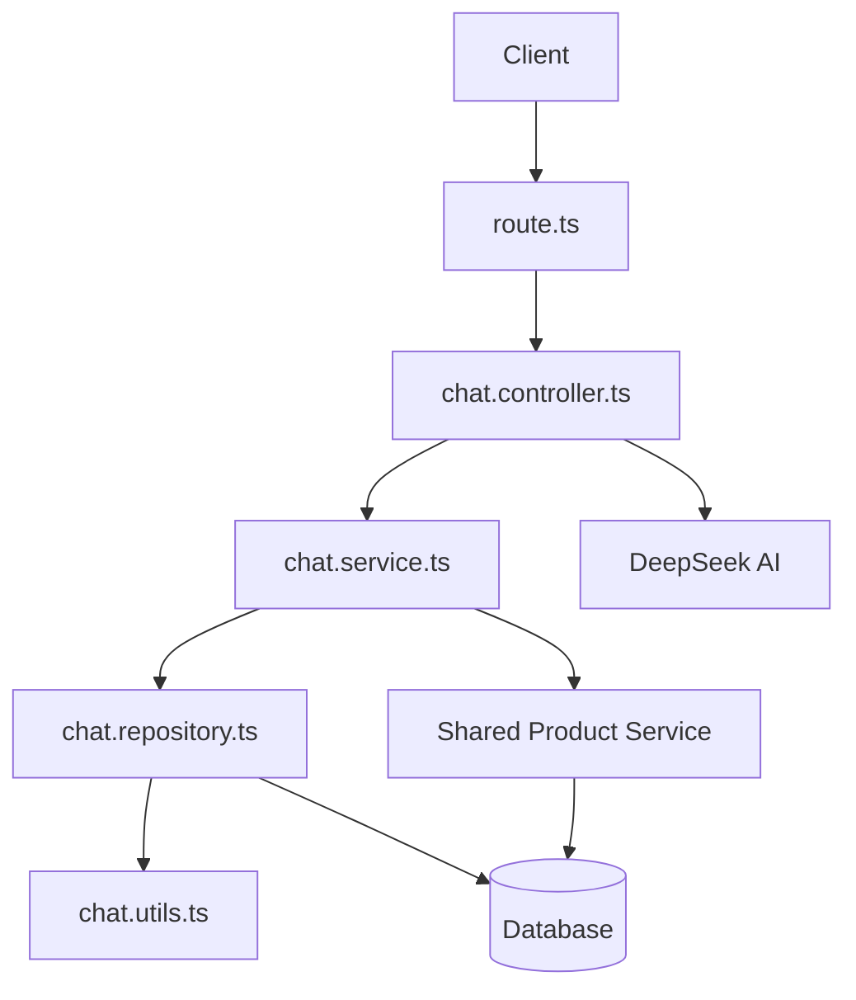
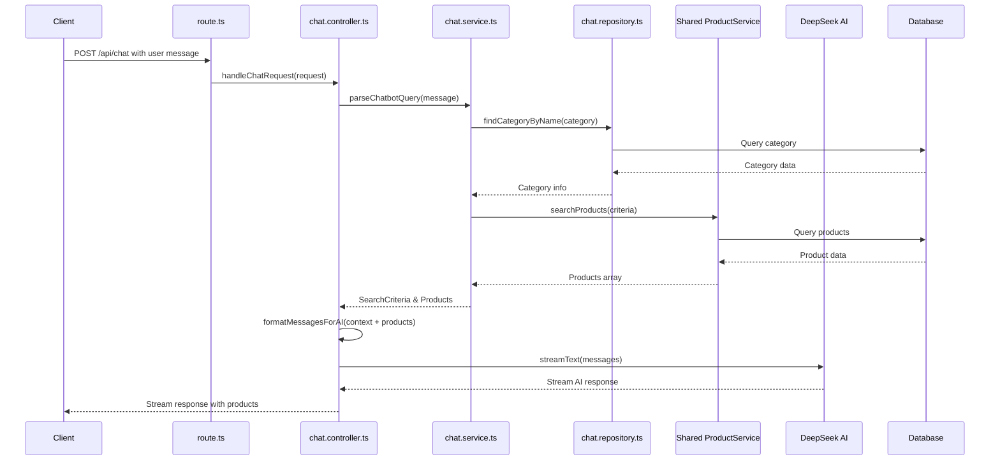
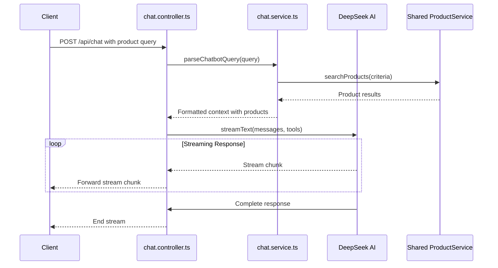

# Chat Feature Architecture

This directory contains the chat feature implementation for the BodyFuel application, which provides AI-powered product search and recommendations through a conversational interface using DeepSeek AI.

## Directory Structure

```
apps/shop/src/app/api/chat/
├── chat.controller.ts  # HTTP request handlers with DeepSeek AI integration
├── chat.repository.ts  # Data access layer
├── chat.service.ts     # Business logic layer
├── chat.types.ts       # TypeScript type definitions
├── chat.utils.ts       # Helper functions
├── route.ts           # Next.js API route configuration
└── README.md          # This documentation
```

## Architecture Overview

The chat feature follows a flattened Controller-Service-Repository pattern optimized for Next.js API routes:



## Component Interactions

### Request Flow

1. **Client Request**: The client sends a chat message to the `/api/chat` Next.js API route
2. **Route Handler**: `route.ts` handles the POST request and delegates to the controller
3. **Controller**: `chat.controller.ts` validates the request and orchestrates the AI response using DeepSeek
4. **Service Layer**: `chat.service.ts` handles business logic including:
   - Product query detection and search
   - Message formatting for AI context
   - Integration with shared product service
5. **Repository**: `chat.repository.ts` provides data access for categories and streaming utilities
6. **AI Integration**: DeepSeek AI processes the formatted context and generates streaming responses
7. **Response**: The controller streams the AI response back to the client

### Data Flow for Product Search



### Streaming Response Flow

The feature uses AI SDK's streaming capabilities with DeepSeek for real-time responses:



## Key Components

### Route Handler

- **route.ts**: Next.js API route that handles POST requests to `/api/chat`
  - Exports `POST` function that delegates to the controller
  - Handles CORS and request validation

### Controller

- **chat.controller.ts**: Main request handler with DeepSeek AI integration
  - `handleChatRequest`: Processes chat messages and generates AI responses with product context
  - Integrates with DeepSeek AI for intelligent product recommendations
  - Handles both single message and message array formats
  - Implements streaming responses for real-time interaction

### Service

- **chat.service.ts**: Consolidated business logic layer
  - `parseChatbotQuery`: Extracts search queries and price ranges from user messages
  - `findProducts`: Searches for products using shared product service
  - `formatMessagesForAI`: Prepares messages and context for AI processing
  - `createSystemMessage`: Generates system prompts for the AI
  - `formatProductsForAI`: Formats product data for AI context
  - `createProductHtml`: Generates HTML for product display

### Repository

- **chat.repository.ts**: Minimal data access layer
  - `findCategoryByName`: Finds categories by name for product search
  - Re-exports streaming utilities from chat.utils.ts
  - Lightweight implementation leveraging shared services

### Types

- **chat.types.ts**: TypeScript type definitions
  - `ChatMessage`: Represents a single message in a conversation
  - `ChatRequestSchema`: Zod schema for request validation (supports both message formats)
  - `ChatbotSearchCriteria`: Search parameters for product queries
  - Enhanced type safety with flexible request handling

### Utilities

- **chat.utils.ts**: Consolidated helper functions
  - `findCategoryBySearchTerm`: Category matching logic
  - `extractCategoryFromMessage`: Extracts category from user messages
  - `expandSearchQuery`: Expands search queries with variations
  - `extractPriceRange`: Identifies price constraints in messages
  - `buildWhereClause`: Builds database query conditions
  - `createDataStreamResponse`: Creates streaming response utilities

## Usage Examples

### Processing a Chat Message

```typescript
// In the Next.js API route
import { handleChatRequest } from "./chat.controller";

export async function POST(request: NextRequest) {
  return handleChatRequest(request);
}
```

### Using the Service Layer

```typescript
// In a controller or other service
import * as chatService from "./chat.service";

async function handleProductQuery(userMessage: string) {
  // Extract search criteria from the user message
  const criteria = await chatService.parseChatbotQuery(userMessage);

  // Find products matching the criteria using shared service
  const products = await chatService.findProducts(criteria);

  // Format for AI context
  const context = chatService.formatProductsForAI(products);

  return { criteria, products, context };
}
```

### Category Matching

```typescript
// In a service
import { findCategoryByName } from "./chat.repository";

async function getCategoryFromMessage(message: string) {
  const category = await findCategoryByName("protein powder");

  if (category) {
    console.log(`Found category: ${category.name} (ID: ${category.id})`);
    return category;
  }

  return null;
}
```

## Best Practices

1. **Flattened Architecture**: Keep related functionality in consolidated files rather than deep folder structures
2. **Shared Services**: Leverage existing shared services (like `@repo/shared` productService) instead of duplicating logic
3. **Type Safety**: Use the defined types from `chat.types.ts` and Zod schemas for validation
4. **Streaming Responses**: Utilize AI SDK's streaming capabilities for better user experience
5. **Error Handling**: Implement proper error boundaries and validation
6. **Testing**: Write unit tests for service functions and utilities

## Architecture Benefits

### Flattened Structure

- **Faster Development**: Fewer folders to navigate, easier to find and modify code
- **Reduced Complexity**: Single files contain related functionality instead of spreading across multiple files
- **Better Maintainability**: Clear file naming convention (`chat.*.ts`) makes purpose obvious

### Shared Service Integration

- **DRY Principle**: Reuses existing product search logic from `@repo/shared`
- **Consistency**: Same product search behavior across the application
- **Reduced Maintenance**: Updates to product logic benefit all features

### Next.js API Route Integration

- **Modern Framework**: Leverages Next.js 13+ App Router API routes
- **TypeScript Native**: Full TypeScript support throughout the stack
- **Streaming Support**: Built-in streaming capabilities with AI SDK

## Extending the Feature

When extending the chat feature:

1. **Add Types**: Update `chat.types.ts` with new type definitions
2. **Service Logic**: Implement new business logic in `chat.service.ts`
3. **Data Access**: Add new repository methods to `chat.repository.ts` if needed
4. **Controller Updates**: Modify `chat.controller.ts` to handle new request types
5. **Utilities**: Add helper functions to `chat.utils.ts`
6. **Documentation**: Update this README to reflect changes

### Adding New AI Capabilities

```typescript
// Example: Adding sentiment analysis
export async function analyzeSentiment(message: string) {
  // Add to chat.service.ts
  const sentiment = await deepseek.generateText({
    model: "deepseek-chat",
    prompt: `Analyze the sentiment of this message: "${message}"`,
  });

  return sentiment;
}
```

## Dependencies

### Core Dependencies

- **@ai-sdk/deepseek**: DeepSeek AI integration
- **ai**: AI SDK for streaming responses
- **zod**: Schema validation
- **@repo/shared**: Shared product service

### Environment Variables

- `DEEPSEEK_API`: DeepSeek API key (required)

## Performance Considerations

1. **Streaming**: Responses are streamed for better perceived performance
2. **Shared Services**: Leverages cached product data from shared service
3. **Minimal Repository**: Lightweight data access layer
4. **Type Validation**: Early request validation prevents unnecessary processing

## Known Issues and Limitations

- Product search is limited to 5 results per query (configurable in service)
- DeepSeek API key required for AI functionality
- Category matching is currently exact match (could be enhanced with fuzzy matching)

## Migration Notes

This feature was migrated from Express backend to Next.js API routes with the following changes:

1. **Architecture**: Moved from folder-based structure to flattened file naming
2. **AI Integration**: Replaced custom streaming with AI SDK + DeepSeek
3. **Service Integration**: Now uses shared product service instead of duplicate logic
4. **Request Handling**: Enhanced to support both single message and message array formats
5. **Type Safety**: Improved with Zod schemas and enhanced TypeScript types

## Future Improvements

- Implement conversation persistence with database storage
- Add user context for personalized recommendations
- Enhance category matching with fuzzy search or ML
- Add support for multi-turn conversations with memory
- Implement rate limiting and API key management
- Add comprehensive logging and monitoring
- Enhanced product filtering and sorting options
