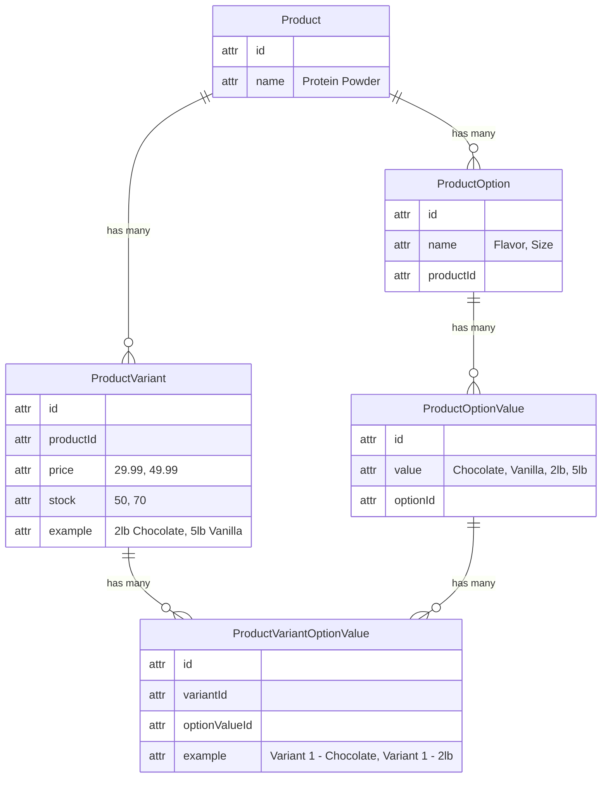

```mermaid
erDiagram
    Product {
        attr id
        attr name "Protein Powder"
    }
    ProductVariant {
        attr id
        attr productId
        attr price "29.99, 49.99"
        attr stock "50, 70"
        attr example "2lb Chocolate, 5lb Vanilla"
    }
    ProductOption {
        attr id
        attr name "Flavor, Size"
        attr productId
    }
    ProductOptionValue {
        attr id
        attr value "Chocolate, Vanilla, 2lb, 5lb"
        attr optionId
    }
    ProductVariantOptionValue {
        attr id
        attr variantId
        attr optionValueId
        attr example "Variant 1 - Chocolate, Variant 1 - 2lb"
    }
    Product ||--o{ ProductVariant : "has many"
    Product ||--o{ ProductOption : "has many"
    ProductOption ||--o{ ProductOptionValue : "has many"
    ProductVariant ||--o{ ProductVariantOptionValue : "has many"
    ProductOptionValue ||--o{ ProductVariantOptionValue : "has many"
```
